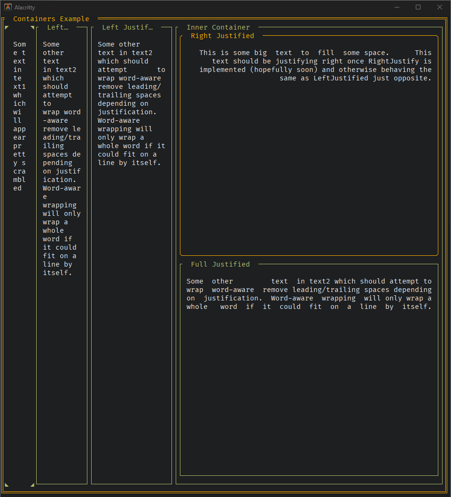

# Tooey

 [](https://raw.githack.com/wiki/asciifaceman/tooey/coverage.html) [](https://goreportcard.com/report/github.com/asciifaceman/tooey)

Tooey is a cross-platform and customizable terminal dashboard and widget library built on top of [tcell](https://github.com/gdamore/tcell) (formerly termbox-go pre-fork). This project started as a fork of the fantastic [termui](https://github.com/gizak/termui) but then turned into a ground-up rewrite.

See [FORK.MD](FORK.md) for details of the original fork and README.md

[](./_assets/containers_prototype.png)

## Features

- 24bit colors enabled by TCell
	- Requires your $TERM to end in `-truecolor` [Tcell Docs](https://github.com/gdamore/tcell/tree/main#24-bit-color)
	- Falls back to 256 color otherwise
- Flex-inspired layout engine with `Container`
- Several premade widgets for common use cases
- Easily create custom widgets by extending `Element`
- Position widgets either in containers with flex-like layout or with absolute coordinates
- Keyboard, mouse, and terminal resizing events < UNDER REWORK >
- Colors, Styling, Theming < UNDER REWORK >

## Installation
`go mod init`

`go get github.com/asciifaceman/tooey`

`go mod tidy` after first reference

## Hello World

```go
package main

import (
	"log"

	"github.com/asciifaceman/tooey"
	"github.com/asciifaceman/tooey/widgets"
)

func main() {
	if err := tooey.Init(); err != nil {
		log.Fatalf("failed to initialize tooey: %v", err)
	}
	defer tooey.Close()

	p := widgets.NewText()
	p.SetTheme(themes.ThemeRetroTerminalOrange)
	p.Title.Content = "Text Title"
	p.Content = "Hello World!"
	p.SetRect(0, 0, 25, 5)

	tooey.Render(p)

	time.Sleep(time.Duration(time.Second * 5)) // events returning soon
}
```

## Widgets

- [Element](./_examples/element.go) (Primitive)
- [Container](./_examples/containers.go) (Flex layout)
- [Text](./_examples/text.go)
- WIP

Run an example with `go run _examples/{example}.go` or run each example consecutively with `make run-examples`.

## Documentation

- [wiki](https://github.com/asciifaceman/tooey/wiki)

## License

[MIT](http://opensource.org/licenses/MIT)

## Authors

- (Originally) Gizak
- Charles (asciifaceman) Corbett
- [Extended Authors](./AUTHORS.md)